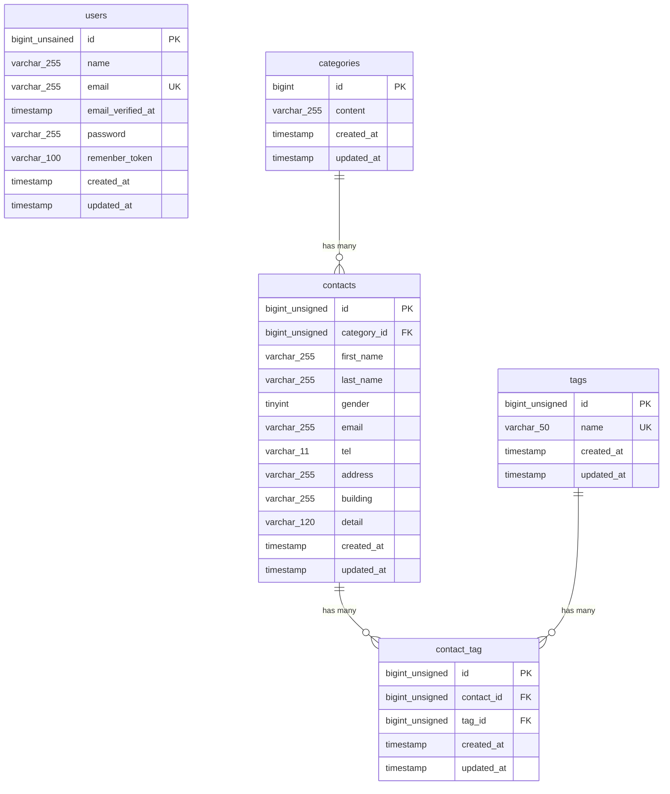

# COACHTECH お問い合わせフォーム

お問い合わせフォームの機能を実装したLaravelプロジェクトです。一般ユーザーがお問い合わせを送信でき、管理者がログイン後にその内容を確認・管理します。

## 作成者

菅野　まりえ

## 使用技術

- PHP 8.2
- Laravel 10.x
- MySQL 8.0
- Nginx
- Docker/Docker Compose/Laravel Sail
- Laravel Fortify(認証)
- phpMyAdmin

## ER図

## 開発環境URL

http://localhost

## 動作環境

- Docker
- Docker Compose

※Windowsの場合はWSL2の利用を推奨します。

## 環境構築手順

1. **リポジトリをクローン**

    git clone https://github.com/mariekanno/contact-form-app.git

2. **.envファイルの準備**

    .env.exampleをコピーして.envを作成します。

   　　cp .env.example .env

   .envファイル内の以下のDB接続情報を確認・設定します。.envファイル内の以下のDB接続情報を確認・設定します。.env.exampleのデフォルト値はSail向けではないため、以下のように変更してください。

        DB_CONNECTION=mysql
        DB_HOST=mysql
        DB_PORT=3306
        DB_DATABASE=laravel
        DB_USERNAME=sail
        DB_PASSWORD=password

3. **Composer依存パッケージのインストール**

プロジェクトの初回セットアップ時は、vendor ディレクトリが存在しないため sail コマンドを使用できません。 以下のDockerコマンドを実行して、コンテナ内で composer install を実行します。

        docker run --rm \
            -u "$(id -u):$(id -g)" \
            -v "$(pwd):/var/www/html" \
            -w /var/www/html \
            laravelsail/php82-composer:latest \
            composer install --ignore-platform-reqs

4. **Laravel Sailの起動**

 以下のコマンドでDockerコンテナを起動します。
 
    ./vendor/bin/sail up -d

    エイリアスの設定(推奨)
    毎回 ./vendor/bin/sail と入力するのは手間なので、エイリアスを設定すると便利です。

    alias sail='[ -f sail ] && bash sail || bash vendor/bin/sail'

5. **アプリケーションキーの生成**

    sail artisan key:generate

6. **データベースのマイグレーションと初期データ投入**

　以下のコマンドでテーブルを作成し、ダミーデータを投入します。
 
    sail artisan migrate:fresh --seed

　このコマンドの入力後、下記のエラーが表示されることがあります。

　　Illuminate\Database\QueryException 
  SQLSTATE[HY000] [1044] Access denied for user 'sail'@'%' to database 'contact-form-app' (Connection: mysql, SQL: select table_name as `name`,         (data_length + index_length) as `size`, table_comment as `comment`, engine as `engine`, table_collation as `collation` from information_schema.tables where table_schema = 'contact-form-app' and table_type in ('BASE TABLE', 'SYSTEM VERSIONED') order by table_name)

  at vendor/laravel/framework/src/Illuminate/Database/Connection.php:829
    825▕                     $this->getName(), $query, $this->prepareBindings($bindings), $e
    826▕                 );
    827▕             }
    828▕ 
  ➜ 829▕             throw new QueryException(
    830▕                 $this->getName(), $query, $this->prepareBindings($bindings), $e
    831▕             );
    832▕         }
    833▕     }

  +43 vendor frames 

  44  artisan:35
      Illuminate\Foundation\Console\Kernel::handle()

　このエラーはコンテナ内にデータが残っており、エラーが生じているケースなどがあります。 その場合は、以下のコマンドを順に実行して各コンテナを再起動して下さい。

　  sail down -v
　　sail up -d //コマンド実行後にSQLコンテナが立ち上がるまで時間がかかります。30秒ほどお待ちください。
　　sail artisan migrate:fresh --seed
 

7. **フロントエンドのビルド**

    sail npm install
    sail npm install alpinejs
    sail npm run build

9. **アプリケーションへのアクセス**

 ブラウザでhttp://localhostにアクセスします。

## テスト実行

    sail artisan test
    
 カバレッジ付きで実行する場合:
 
    sail artisan test --coverage

## 機能一覧
- ユーザー認証(登録、ログイン、ログアウト)
- お問い合わせ登録・一覧取得・検索・単体取得
- お問い合わせ詳細表示・削除
- CSVエクスポート
- タグ管理(追加・更新・削除)
- 公開API(お問い合わせCRUD)

## APIエンドポイント一覧

認証不要の公開APIです。全エンドポイントは/api/v1プレフィックス配下に定義されています。

| HTTPメソッド | URI | 概要 |
|---|---|---|
| GET | /api/v1/contacts | お問い合わせ一覧(検索・ページネーション付き) |
| GET | /api/v1/contacts/{id} | お問い合わせ詳細(カテゴリタグ含む) |
| POST | /api/v1/contacts | お問い合わせ新規作成 |
| PUT | /api/v1/contacts/{id}  | お問い合わせ更新 |
| DELETE | /api/v1/contacts/{id}  | お問い合わせ削除 |
