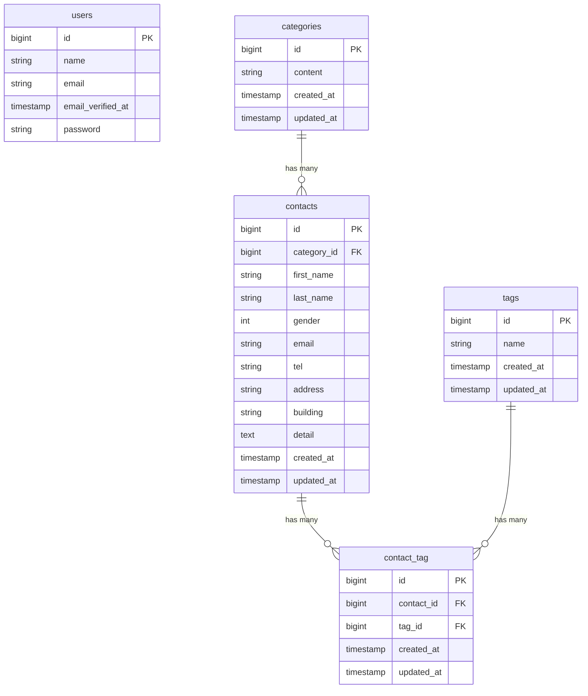

# COACHTECH お問い合わせフォーム

お問い合わせの管理を行うシステムです。

ユーザーはお問い合わせフォームから内容を送信でき、管理者はログイン後にお問い合わせの検索・閲覧・削除・CSV出力・タグ管理を行うことができます。また、お問い合わせ情報を操作する公開APIも実装しています。

## 作成者

菅野　まりえ

## 使用技術

- PHP 8.2
- Laravel 10
- MySQL 8.0
- Docker
- Laravel Sail
- Fortify
- Tailwind CSS

## ER図



## 開発環境URL

フロントエンド：http://localhost
管理画面：http://localhost/admin
phpMyAdmin:http://localhost:8080

## 動作環境

- PHP 8.2
- Laravel 10
- MySQL 8.0
- Docker
- Laravel Sail
- Node.js
- npm

## 環境構築手順

1. **リポジトリをクローン**

    ```bash
    git clone https://github.com/mariekanno/contact-form-app.git
    ```

2. **プロジェクトへ移動**

    ```bash
    cd contact-form app

3. **.envファイルの準備**

    ```bash
   cp .env.example .env

4. **Composer依存パッケージのインストール**

    ```bash
    composer install

5. **Laravel Sailの起動**

    ```bash
    ./vendor/bin/sail up -d

6. **アプリケーションキーの生成**

    ```bash
    ./vendor/bin/sail artisan key:generate

7. **データベースのマイグレーションと初期データ投入**

    ```bash
    ./vendor/bin/sail artisan migrate:fresh --seed

8. **フロントエンドのビルド**

    ```bash
    ./vendor/bin/sail npm install
    ./vendor/bin/sail npm run build

9. **アプリケーションへのアクセス**

    http://localhost

## テスト用アカウント

メールアドレス:test@example.com
パスワード:password

## テスト実行

    ```bash
    ./vendor/bin/sail test

## 機能一覧
- お問い合わせフォーム
- お問い合わせ確認
- お問い合わせ送信
- 管理者登録
- ログイン/ログアウト
- お問い合わせ一覧表示
- お問い合わせ検索
- お問い合わせ詳細表示
- お問い合わせ削除
- タグCRUD
- CSV出力
- 公開API

## APIエンドポイント一覧

お問い合わせ情報を取得・登録・更新・削除するREST APIを実装しています。

| HTTPメソッド | URI | 概要 |
|---|---|---|
| GET | /api/v1/contacts | お問い合わせ一覧取得 |
| GET | /api/v1/contacts/{id} | お問い合わせ詳細取得 |
| POST | /api/v1/contacts | お問い合わせ作成 |
| PUT | /api/v1/contacts/{id}  | お問い合わせ更新 |
| DELETE | /api/v1/contacts/{id}  | お問い合わせ削除 |
